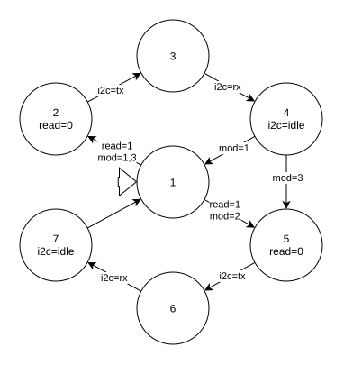

# Sistema Embarcado - Projeto DAC/PWM com PCF8591

Este projeto implementa um sistema embarcado utilizando o microcontrolador STM32L476RG, integrando comunicação I2C com o módulo ADC/DAC PCF8591 e geração de sinais analógicos através de DAC e PWM. O sistema permite ler valores analógicos, controlar amplitudes de onda senoidal, e ajustar ciclos de trabalho PWM baseados em sensores, com alternância de modos através de botão físico.

## Funcionalidades

### Comunicação e Protocolos
- **Interface I2C**: Comunicação com módulo PCF8591 ADC/DAC usando DMA
- **Interface UART**: Debug log via USART2 (não implementado por padrão)

### Processamento de Sinais
- **Leitura de Canais Analógicos**: 2 canais ADC do PCF8591 (A0, A1, 8-bit, 0-255)
- **Saída DAC**: Geração de onda senoidal com amplitude variável (12-bit, 0-4095)
- **Saída PWM**: Controle de duty cycle baseado em sensor (TIM1 CH4)
- **Controle de Amplitude**: Valor do sensor A1 controla amplitude da onda DAC
- **Controle PWM**: Valor do sensor A0 controla duty cycle do PWM

### Alternância de Modos
- **Modo 1**: PWM controlado por sensor A0 (padrão)
- **Modo 2**: DAC com onda senoidal de amplitude controlada por A1
- **Modo 3**: Ambos PWM e DAC ativos simultaneamente
- **Botão B1**: Alterna entre os 3 modos de operação
- **Operação Periódica**: Timer TIM2 dispara leituras automáticas dos sensores

## Controle e Operação

### Alternância de Modos (Botão B1)
O sistema opera em 3 modos alternáveis através do botão B1:

#### **Modo 1: PWM Controlado por Sensor** (Padrão)
- PWM ativo no pino TIM1_CH4 (PA11)
- Duty cycle controlado pelo valor do sensor A0 (0-255 → 0-100%)
- DAC desabilitado
- Leitura periódica automática via TIM2

#### **Modo 2: DAC com Onda Senoidal**
- DAC ativo no pino PA5 gerando onda senoidal
- Amplitude controlada pelo valor do sensor A1 (0-255 → 0-4095)
- PWM desabilitado
- 512 amostras por período de onda
- Trigger via TIM4 para DAC DMA

#### **Modo 3: PWM + DAC Simultâneos**
- PWM ativo (controlado por A0)
- DAC ativo (amplitude controlada por A1)
- Ambas as saídas operando simultaneamente

### Operação Automática
- **Timer TIM2**: Dispara leituras periódicas dos sensores quando em STATE_1
- **DMA I2C**: Leituras e configurações assíncronas do PCF8591
- **DMA DAC**: Geração contínua de onda senoidal no modo 2
- **Proteção Atômica**: Variáveis compartilhadas protegidas com `ATOMIC_READ/WRITE`

## Arquitetura do Sistema

O sistema implementa uma **máquina de estados com 8 estados** para gerenciar a comunicação entre múltiplos periféricos e protocolos de forma eficiente e robusta.

### Diagrama Geral do Sistema



### Máquina de Estados (7 Estados):

1. **STATE_1 (Idle)**: Estado inicial, aguarda eventos de timer ou botão
2. **STATE_2 (Config ADC A0)**: Configura canal A0 do PCF8591 via I2C DMA
3. **STATE_3 (Read ADC A0)**: Lê sensor A0 para controle PWM
4. **STATE_4 (Update PWM)**: Atualiza duty cycle do PWM baseado em A0
5. **STATE_5 (Config ADC A1)**: Configura canal A1 do PCF8591 via I2C DMA
6. **STATE_6 (Read ADC A1)**: Lê sensor A1 para controle de amplitude DAC
7. **STATE_7 (Update DAC)**: Recalcula e atualiza buffer de onda senoidal

### Arquitetura Simplificada:

O sistema foi refatorado para uma arquitetura simplificada e integrada:

#### **PCF8591 I2C (inline em main.c)**
- Comunicação I2C direta com HAL usando DMA
- Estrutura `pcf8591_config_t` com bitfields para controle do chip
- Funções: `PCF8591_set_channel_index()`, `PCF8591_read_analog_channel()`
- Callbacks: `HAL_I2C_MasterTxCpltCallback()`, `HAL_I2C_MasterRxCpltCallback()`
- Suporte para configuração de canais single-ended e differential

#### **Geração de Onda Senoidal**
- Buffer estático `sin_wave_buff[512]` com amostras da onda
- Função `populate_sin_wave_buff(amplitude)` calcula valores usando `sin()` de `math.h`
- DAC DMA transfere buffer continuamente
- TIM4 dispara conversões DAC (TRGO)

#### **Controle PWM**
- TIM1 Channel 4 gera sinal PWM
- Período: 65535 (16-bit)
- Função `set_pwm_duty(htim, channel, duty)` atualiza compare value
- Duty cycle proporcional ao valor do sensor (0-255 → 0-100%)

#### **Proteção de Concorrência**
- Macros `ATOMIC_READ(var)` e `ATOMIC_WRITE(var, value)`
- Desabilitam interrupções durante acesso a variáveis compartilhadas
- Protegem `system_state`, `i2c`, `mode`, `read` de race conditions
- Essencial para sincronização entre ISR e main loop

### Fluxos de Operação:

#### Modo 1 (PWM Controlado):
```
TIM2 Interrupt → STATE_1 (set read flag)
→ STATE_2 (config A0) → STATE_3 (read A0) 
→ STATE_4 (update PWM) → STATE_1 (idle)
```

#### Modo 2 (DAC Controlado):
```
TIM2 Interrupt → STATE_1 (set read flag)
→ STATE_5 (config A1) → STATE_6 (read A1)
→ STATE_7 (update amplitude) → STATE_1 (idle)
(DAC DMA runs continuously triggered by TIM4)
```

#### Modo 3 (PWM + DAC):
```
TIM2 Interrupt → STATE_1 (set read flag)
→ STATE_2 (config A0) → STATE_3 (read A0) → STATE_4 (update PWM)
→ STATE_5 (config A1) → STATE_6 (read A1) → STATE_7 (update amplitude)
→ STATE_1 (idle)
```

#### Alternância de Modos (Button B1):
```
Button Press (EXTI) → HAL_GPIO_EXTI_Callback()
→ Increment mode (1→2→3→1)
→ Start/Stop DAC DMA or PWM accordingly
```

## Configuração de Hardware

- **Microcontrolador**: STM32L476RG (Nucleo-L476RG)
  - **Saída DAC**: Pino PA5 do STM32
    - Resolução: 12-bit (0-4095)
    - Onda senoidal: 512 amostras por período
    - Trigger: TIM4 TRGO
  - **Saída PWM**: Pino PA11 (TIM1_CH4)
    - Período: 65535 (16-bit)
    - Duty cycle variável: 0-100%
  - **Botão**: B1 (PC13) para alternância de modos
  - **Timers**: 
    - TIM2: Leituras periódicas (500ms)
    - TIM4: Trigger para DAC DMA
  - **DMA**: Canais para I2C3 (TX/RX) e DAC CH2
- **Módulo ADC/DAC**: PCF8591 (endereço I2C: 0x48)
  - Conexões I2C: SDA (PC1) e SCL (PC0) conectados ao I2C3 do STM32
  - 2 canais ADC utilizados: A0 (para PWM) e A1 (para DAC)
  - Resolução ADC: 8-bit (0-255)

## Estrutura do Projeto

```
.
├── Core/
│   ├── Inc/                  # Arquivos de cabeçalho
│   │   ├── main.h           # Definições principais e protótipos
│   │   ├── circular_buffer.h # API do buffer circular (legado)
│   │   ├── cmd_driver.h     # API do driver de comandos UART (legado)
│   │   ├── stm32l4xx_hal_conf.h # Configuração HAL
│   │   └── stm32l4xx_it.h   # Tratadores de interrupção
│   └── Src/                 # Código-fonte
│       ├── main.c           # Programa principal, máquina de estados e PCF8591
│       ├── circular_buffer.c # Buffer circular (legado)
│       ├── cmd_driver.c     # Driver de comandos (legado)
│       ├── stm32l4xx_hal_msp.c # Inicialização MSP (DMA, GPIO, I2C, DAC, PWM)
│       ├── stm32l4xx_it.c   # Handlers de interrupção (DMA, I2C, EXTI)
│       └── system_stm32l4xx.c # Inicialização do sistema
├── Drivers/                 # Drivers HAL e CMSIS da ST
│   ├── STM32L4xx_HAL_Driver/ # Biblioteca HAL
│   └── CMSIS/               # CMSIS Core e Device
├── docs/                    # Documentação do projeto
│   ├── state_machine_diagram.md # Documentação detalhada dos estados
│   └── images/              # Diagramas e imagens
│       ├── state_machine.jpg # Diagrama principal de estados
│       └── Diagrama de estados cmd.svg # Diagrama do processador de comandos
├── build/                   # Diretório de saída da compilação
├── Makefile                 # Sistema de build
├── STM32L476XX_FLASH.ld     # Script de linker
├── startup_stm32l476xx.s    # Arquivo de inicialização
└── emebedded_sys_2025.2.ioc # Configuração do STM32CubeMX
```

## Como Usar

### 1. Configuração Inicial
Após compilar e gravar o firmware:

1. **Conecte o PCF8591** ao STM32L476RG:
   - SDA: PC1 (I2C3_SDA)
   - SCL: PC0 (I2C3_SCL)
   - VCC: 3.3V ou 5V
   - GND: GND

2. **Conecte sensores** aos canais ADC do PCF8591:
   - **AIN0**: Potenciômetro ou sensor para controle PWM (0-255)
   - **AIN1**: Potenciômetro ou sensor para controle amplitude DAC (0-255)

3. **Saídas do STM32**:
   - **PA5 (DAC_OUT)**: Conecte osciloscópio ou alto-falante para ver/ouvir onda senoidal
   - **PA11 (TIM1_CH4)**: Conecte LED ou osciloscópio para ver PWM

4. **Botão B1** (PC13): Pré-instalado na placa Nucleo

5. Sistema iniciará no **Modo 1** (PWM ativo)

### 2. Operação no Modo 1 (PWM - Padrão)
1. Sistema inicia neste modo automaticamente
2. **Ajuste o potenciômetro/sensor em AIN0**:
   - Valor baixo (próximo a 0): Duty cycle próximo a 0%
   - Valor médio (128): Duty cycle ~50%
   - Valor alto (255): Duty cycle ~100%
3. Observe a saída PWM em **PA11** com osciloscópio ou LED
4. Atualização automática a cada 500ms (TIM2)

### 3. Mudança para Modo 2 (DAC)
1. **Pressione o botão B1** uma vez
2. PWM é desativado automaticamente
3. DAC começa a gerar onda senoidal em **PA5**
4. **Ajuste o potenciômetro/sensor em AIN1**:
   - Valor baixo: Amplitude próxima a zero (sem onda)
   - Valor médio (128): Amplitude ~2048 (~1.65V p-p)
   - Valor alto (255): Amplitude máxima 4095 (~3.3V p-p)
5. Conecte osciloscópio ou alto-falante para visualizar/ouvir a onda
6. Frequência da onda determinada por TIM4 period

### 4. Mudança para Modo 3 (PWM + DAC)
1. **Pressione o botão B1** novamente
2. PWM é reativado mantendo DAC ativo
3. **AIN0 controla PWM** (PA11)
4. **AIN1 controla amplitude DAC** (PA5)
5. Ambas as saídas operam simultaneamente
6. Ideal para controles independentes

### 5. Retorno ao Modo 1
1. **Pressione o botão B1** mais uma vez
2. DAC é desativado
3. Retorna ao Modo 1 (apenas PWM)
4. Ciclo continua: Modo 1 → Modo 2 → Modo 3 → Modo 1...

## Configuração dos Periféricos

### PCF8591 (ADC/DAC via I2C3)
- **Endereço I2C**: 0x48 (7-bit), 0x90 (8-bit shifted)
- **Pinos I2C3**: PC0 (SCL), PC1 (SDA)
- **Canais ADC utilizados**: A0 (PWM control), A1 (DAC amplitude)
- **Resolução ADC**: 8-bit (0-255)
- **Alimentação**: 3.3V ou 5V
- **Modo de Operação**: 4 canais single-ended (`four_single_ended = 0b00`)
- **Clock I2C**: 100 kHz (Standard Mode)
- **DMA**: Habilitado para TX e RX

### DAC1 (Saída Analógica)
- **Pino**: PA5 (DAC1_OUT2)
- **Resolução**: 12-bit (0-4095)
- **Alinhamento**: Right-aligned
- **Trigger**: TIM4 TRGO (Timer 4 Update Event)
- **DMA**: Channel 4 para transferência contínua do buffer
- **Buffer**: 512 amostras de onda senoidal
- **Forma de onda**: Senoidal calculada com `sin()` de `math.h`

### TIM1 (PWM Output)
- **Pino**: PA11 (TIM1_CH4)
- **Prescaler**: 0 (clock total)
- **Período (ARR)**: 65535 (16-bit)
- **Modo**: PWM Mode 1
- **Compare Value**: Calculado como `(Period * duty) / 255`
- **Frequência PWM**: ~1.2 kHz (80 MHz / 65536)

### TIM2 (Trigger Periódico)
- **Função**: Dispara leituras de sensores periodicamente
- **Prescaler**: 7999 (divide por 8000)
- **Período (ARR)**: 500
- **Frequência de Atualização**: ~2 Hz (a cada 500ms)
- **Modo**: Interruption mode
- **Callback**: `HAL_TIM_PeriodElapsedCallback()`

### TIM4 (Trigger DAC)
- **Função**: Trigger para conversões DAC DMA
- **Prescaler**: 7999
- **Período (ARR)**: 10
- **Frequência**: ~1 kHz
- **Master Mode**: Update event (TRGO)
- **Conectado**: DAC1 Channel 2 trigger

## Pré-requisitos

Certifique-se de que as seguintes ferramentas estão instaladas no seu sistema:

- GCC ARM toolchain (`gcc-arm-none-eabi`)
- Make
- CMake
- Ferramentas ST-Link (`stlink-tools`)

Você pode instalar essas dependências executando o script `setup_env.sh`:

```bash
sudo setup_env.sh
```

## Ambiente de Desenvolvimento

Para configurar o ambiente de desenvolvimento no Visual Studio Code, as seguintes extensões são recomendadas:

- [**C/C++ Extension Pack**](https://marketplace.visualstudio.com/items?itemName=ms-vscode.cpptools-extension-pack): Fornece suporte para desenvolvimento em C/C++.
- [**CMake Tools**](https://marketplace.visualstudio.com/items?itemName=ms-vscode.cmake-tools): Suporte para projetos baseados em CMake.
- [**Makefile Tools**](https://marketplace.visualstudio.com/items?itemName=ms-vscode.makefile-tools): Suporte para projetos baseados em Makefile.
- [**Code Spell Checker**](https://marketplace.visualstudio.com/items?itemName=streetsidesoftware.code-spell-checker): Verificador ortográfico para melhorar a qualidade do código e documentação.

Você pode instalar essas extensões na Visual Studio Code Marketplace.

## Compilando o Projeto

Para compilar o projeto, execute o seguinte comando:

```bash
make
```

Isso gerará os seguintes arquivos no diretório `build/`:

- `emebedded_sys_2025.2.elf`: Arquivo executável
- `emebedded_sys_2025.2.hex`: Arquivo Intel HEX
- `emebedded_sys_2025.2.bin`: Arquivo binário

## Gravando o Firmware

Para gravar o firmware no microcontrolador STM32L476RG, conecte sua placa via ST-Link e execute:

```bash
make upload
```

Isso gravará o arquivo binário na memória flash do microcontrolador no endereço `0x8000000`.

## Limpando a Compilação

Para limpar os arquivos gerados na compilação, execute:

```bash
make clean
```

## Configuração do Projeto

O projeto está configurado para o microcontrolador STM32L476RG com as seguintes definições:

- **CPU**: Cortex-M4
- **FPU**: FPv4-SP-D16
- **Float ABI**: Hard
- **Otimização**: Debug (`-Og`)

Você pode modificar essas configurações no `Makefile`.

## Licença

Este projeto está licenciado sob a Licença MIT. Consulte o arquivo `LICENSE` para mais detalhes.

## Desenvolvimento

### Contribuindo
Para contribuir com este projeto:

1. **Crie um Novo Branch**: Use nomes descritivos como `feature/nome-da-funcionalidade`
2. **Atualize com STM32CubeMX**: Use o arquivo `.ioc` para configurações de hardware
3. **Mantenha Arquitetura Modular**: Novos periféricos devem ter drivers separados
4. **Teste Funcionalidades**: Verifique todos os estados da máquina de estados
5. **Documente Mudanças**: Atualize README e state_machine_diagram.md
6. **Envie Pull Request**: Mantenha o branch atualizado com `main`

### Debugging
- Use `HAL_UART_Transmit` para debug via serial
- Habilite `#define DEBUG` para mensagens de transição de estado
- Monitor o sistema através das mensagens de debug UART
- Utilize breakpoints nos callbacks para verificar fluxo
- Verifique timeouts de I2C/SPI para detectar problemas de hardware
- Use osciloscópio para analisar sinais I2C/SPI em caso de falhas

## Referências

- [Datasheet PCF8591](https://www.nxp.com/docs/en/data-sheet/PCF8591.pdf) - ADC/DAC 8-bit I2C
- [Datasheet MAX7219](https://datasheets.maximintegrated.com/en/ds/MAX7219-MAX7221.pdf) - LED Display Driver
- [STM32L476RG Reference Manual](https://www.st.com/resource/en/reference_manual/rm0351-stm32l47xxx-stm32l48xxx-stm32l49xxx-and-stm32l4axxx-advanced-armbased-32bit-mcus-stmicroelectronics.pdf) - Microcontrolador
- [Documentação STM32 HAL](https://www.st.com/en/embedded-software/stm32cube.html) - Hardware Abstraction Layer
- [I2C Protocol Guide](https://www.ti.com/lit/an/slva704/slva704.pdf) - Especificação do protocolo I2C
- [SPI Protocol Guide](https://www.analog.com/en/analog-dialogue/articles/introduction-to-spi-interface.html) - Especificação do protocolo SPI
- [STM32L4 DMA Documentation](https://www.st.com/resource/en/application_note/dm00046011-using-the-stm32f2-stm32f4-and-stm32f7-series-dma-controller-stmicroelectronics.pdf) - Direct Memory Access