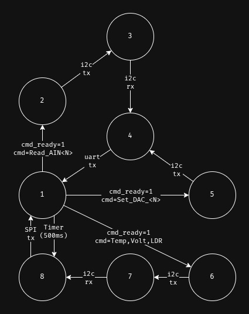

# Diagramas de Controle do Sistema

O projeto implementa um sistema embarcado com controle de estados para gerenciar múltiplas interfaces de comunicação (I2C, SPI, UART) e integração de periféricos (PCF8591 ADC/DAC, MAX7219 LED display).

## Diagramas Visuais

### Diagrama Geral do Sistema


### Processamento de Comandos


## Descrição dos Sistemas:

### Arquitetura Modular
O sistema foi refatorado para uma arquitetura modular com drivers especializados:
- **circular_buffer**: Estrutura de dados para buffer circular UART
- **cmd_driver**: Driver dedicado para processamento de comandos UART
- **PCF8591_driver**: Driver I2C para comunicação com módulo ADC/DAC
- **MAX7219_driver**: Driver SPI para controle de display LED 8x8

### Máquina de Estados (8 Estados)
O sistema opera através de uma máquina de estados com 8 estados principais:

#### **SYSTEM_STATE_1** - Estado Inicial/Idle
- Processa comandos UART recebidos através do `cmd_tick()`
- Aguarda novos comandos ou eventos do timer
- Ponto de retorno após conclusão de operações

#### **SYSTEM_STATE_2** - Configuração ADC para Leitura
- Configura o canal ADC do PCF8591 via I2C
- Transição para STATE_3 após transmissão I2C completa
- Acionado por comandos `Read_AIN<N>`

#### **SYSTEM_STATE_3** - Leitura ADC
- Realiza leitura do canal ADC configurado
- Recebe 2 bytes via I2C (primeiro byte descartado, segundo é o valor)
- Transição para STATE_4 após recepção completa

#### **SYSTEM_STATE_4** - Transmissão UART
- Envia resposta formatada via UART
- Exibe valores lidos (`AIN<N>: <valor>`) ou confirmações DAC
- Retorna para STATE_1 após transmissão completa

#### **SYSTEM_STATE_5** - Configuração DAC
- Escreve valor no DAC do PCF8591 via I2C
- Acionado por comandos `Set_DAC_<VALOR>`
- Transição para STATE_4 para confirmação

#### **SYSTEM_STATE_6** - Configuração Display + ADC
- Prepara buffer de display com ícone selecionado (T/V/L)
- Configura canal ADC correspondente ao sensor
- Acionado por comandos `Temp`, `Volt`, `LDR`
- Transição para STATE_7

#### **SYSTEM_STATE_7** - Leitura ADC para Display
- Lê valor do canal ADC configurado
- Compara com valor anterior para determinar tendência
- Atualiza buffer[0] com ícone de tendência (+/-)
- Transição para STATE_8

#### **SYSTEM_STATE_8** - Atualização Display SPI
- Envia dados para MAX7219 via SPI com DMA
- Alterna entre dois buffers de display (ícone + tendência)
- Acionado periodicamente por timer ou após leitura de sensor
- Retorna para STATE_1 após transmissão SPI completa

### Sistema de Processamento de Comandos (cmd_driver)
- **Buffer Circular**: Implementa buffer circular de 1024 bytes para recepção UART
- **Parser de Comandos**: Analisa strings completas terminadas por `\n` ou `\r`
- **Comandos Suportados**:
  - `Read_AIN<N>`: Leitura de canais ADC (0-3)
  - `Set_DAC_<VALOR>`: Configuração DAC (0-255)
  - `Temp`: Exibe ícone de temperatura e monitora sensor
  - `Volt`: Exibe ícone de tensão e monitora sensor
  - `LDR`: Exibe ícone de luz e monitora sensor LDR
- **Callback Assíncrono**: Notifica `process_uart_commands()` quando comando completo é recebido
- **Máquina de Estados CMD**: Gerencia estados IDLE, RECEIVING, READY

### Sistema de Comunicação I2C (PCF8591_driver)
- **Operações Assíncronas**: Utiliza HAL_I2C_IT para comunicação não-bloqueante
- **Configuração ADC**: Seleciona canal analógico (A0-A3) através do byte de controle
- **Leitura de Dados**: Recebe valores de 8-bit dos canais ADC (leitura de 2 bytes)
- **Configuração DAC**: Define saída analógica (0-255) no PCF8591
- **Gestão de Callbacks**: `tx_cplt_callback` e `rx_cplt_callback` para sincronização de estados
- **Buffer de Dados**: Mantém valores atuais dos 4 canais ADC

### Sistema de Display SPI (MAX7219_driver)
- **Interface SPI**: Comunicação com display LED 8x8 via SPI1 com DMA
- **Buffer de Tela**: Mantém 8 bytes representando estado atual do display
- **Controle de CS**: Gerencia chip select (GPIO) para comunicação
- **Atualização por Linha**: Atualiza display linha por linha (DIGIT0-DIGIT7)
- **Callback de Transmissão**: Sincroniza com máquina de estados principal
- **Ícones Pré-definidos**: 
  - Temperatura (T)
  - Tensão (V)
  - Luz (L)
  - Tendência positiva (+)
  - Tendência negativa (-)

### Sistema de Interface UART
- **Recepção por Interrupção**: Utiliza DMA para recepção eficiente
- **Transmissão Assíncrona**: HAL_UART_Transmit_DMA para respostas
- **Callback de Conclusão**: Sincroniza com máquina de estados
- **Buffer Circular**: Gerenciado pelo cmd_driver para robustez
- **Validação de Comandos**: Verifica sintaxe e parâmetros antes da execução

### Sistema de Temporização
- **Timer Periódico (TIM2)**: Dispara atualizações periódicas do display
- **Callback de Timer**: Transita para STATE_8 a partir de STATE_1
- **Display Alternado**: Alterna entre dois buffers para criar animação
- **Refresh Rate**: Controlado pelo período do timer

## Fluxos de Operação:

### Leitura de Canal ADC (Comando Read_AIN):
```
Estado 1: Comando UART recebido → Parser identifica Read_AIN<N>
Estado 2: Configuração I2C → Seleciona canal ADC
Estado 3: Leitura I2C → Recebe valor ADC (2 bytes)
Estado 4: Resposta UART → Transmite "AIN<N>: <valor>"
Estado 1: Retorna para modo idle
```

### Configuração de DAC (Comando Set_DAC):
```
Estado 1: Comando UART recebido → Parser identifica Set_DAC_<VALOR>
Estado 5: Configuração I2C → Escreve valor no DAC
Estado 4: Confirmação UART → Transmite "Valor do DAC: <valor>"
Estado 1: Retorna para modo idle
```

### Monitoramento de Sensor com Display (Comandos Temp/Volt/LDR):
```
Estado 1: Comando UART recebido → Parser identifica Temp/Volt/LDR
Estado 6: Prepara display com ícone → Configura canal ADC correspondente
Estado 7: Lê valor do sensor → Compara com leitura anterior
         → Determina tendência (+/-)
Estado 8: Atualiza display SPI → Envia ícone + tendência
Estado 1: Retorna para modo idle → Timer dispara nova leitura periódica
```

### Atualização Periódica do Display (Timer):
```
Estado 1: Timer TIM2 dispara → Callback de período
Estado 8: Atualização display → Alterna entre buffers
         → Transmissão SPI com DMA
Estado 1: Retorna para modo idle
```

## Principais Funções:

### Camada de Aplicação (main.c)
- **`process_uart_commands(char *cmd, uint16_t size)`**: Callback de processamento de comandos
- **`set_system_state(SystemState new_state)`**: Transição segura de estados
- **`get_system_state(void)`**: Leitura atômica do estado atual
- **`HAL_TIM_PeriodElapsedCallback()`**: Callback do timer para atualização periódica

### Driver PCF8591 (PCF8591_driver)
- **`PCF8591_Init()`**: Inicialização do driver com callbacks
- **`PCF8591_set_channel_index(uint8_t channel)`**: Configura canal ADC (0-3)
- **`PCF8591_read_analog_channel()`**: Inicia leitura assíncrona do canal atual
- **`PCF8591_write_dac(uint8_t value)`**: Configura saída DAC (0-255)
- **`PCF8591_get_channel_index()`**: Retorna canal ADC ativo
- **`PCF8591_tx_cplt_handler()`**: Handler de transmissão I2C completa
- **`PCF8591_rx_cplt_handler()`**: Handler de recepção I2C completa

### Driver MAX7219 (MAX7219_driver)
- **`MAX7219_Init()`**: Inicialização do display com SPI e callbacks
- **`MAX7219_Write(uint16_t address, uint8_t data)`**: Escreve em registro do MAX7219
- **`MAX7219_UpdateScreen(uint8_t new_screen[8])`**: Atualiza buffer e inicia transmissão
- **`MAX7219_TxCpltHandle()`**: Handler de transmissão SPI completa
- Configuração de brilho, modo de decodificação, e scan limit

### Driver de Comandos (cmd_driver)
- **`cmd_driver_init()`**: Inicializa driver com UART e callback
- **`cmd_tick()`**: Processa buffer circular e detecta comandos completos
- **`cmd_get_state()`**: Retorna estado atual do processador de comandos
- **Estados**: CMD_STATE_IDLE, CMD_STATE_RECEIVING, CMD_STATE_READY

### Buffer Circular (circular_buffer)
- **`circular_buffer_init(size_t itemSize)`**: Cria novo buffer circular
- **`circular_buffer_push()`**: Insere dados no buffer
- **`circular_buffer_pop()`**: Remove dados do buffer
- **`circular_buffer_empty()`**: Verifica se buffer está vazio
- **`circular_buffer_full()`**: Verifica se buffer está cheio
- **`circular_buffer_free_space()`**: Retorna espaço disponível
- **Capacidade**: 1024 bytes configurável

### Callbacks HAL
- **`HAL_I2C_MasterTxCpltCallback()`**: Processa conclusão de transmissão I2C
- **`HAL_I2C_MasterRxCpltCallback()`**: Processa conclusão de recepção I2C
- **`HAL_SPI_TxCpltCallback()`**: Processa conclusão de transmissão SPI
- **`HAL_UART_TxCpltCallback()`**: Processa conclusão de transmissão UART
- **`HAL_TIM_PeriodElapsedCallback()`**: Processa evento de timer periódico

## Melhorias e Otimizações:

### Arquitetura Modular
- **Separação de Responsabilidades**: Cada driver gerencia seu próprio periférico
- **Reusabilidade**: Drivers podem ser utilizados em outros projetos
- **Manutenibilidade**: Código organizado e de fácil compreensão
- **Testabilidade**: Componentes podem ser testados isoladamente

### Gerenciamento de Estados
- **Transições Atômicas**: Funções `set_system_state()` e `get_system_state()`
- **Rastreamento de Estados**: Variável `last_state` para debug e lógica condicional
- **Debug Opcional**: Mensagens de transição de estado em modo DEBUG
- **Sincronização**: WFI (Wait For Interrupt) para economia de energia

### Comunicação Assíncrona
- **DMA para UART**: Recepção e transmissão sem bloqueio de CPU
- **DMA para SPI**: Atualização eficiente do display LED
- **Interrupções I2C**: Comunicação não-bloqueante com PCF8591
- **Callbacks**: Sincronização precisa entre periféricos e estados

### Detecção de Tendências
- **Comparação de Valores**: Sistema compara leituras consecutivas
- **Indicadores Visuais**: Ícones +/- mostram aumento/diminuição
- **Display Dual**: Alternância entre ícone do sensor e tendência
- **Feedback Visual**: Usuário vê mudanças em tempo real

### Robustez
- **Buffer Circular**: Evita perda de dados UART
- **Validação de Comandos**: Verifica sintaxe antes da execução
- **Mensagens de Erro**: Feedback claro para comandos inválidos
- **Timeout Protection**: Prevenção de travamentos em operações I2C/SPI
- **Aumento de Buffer**: Buffer aumentado para 1024 bytes (commit 1c45880)