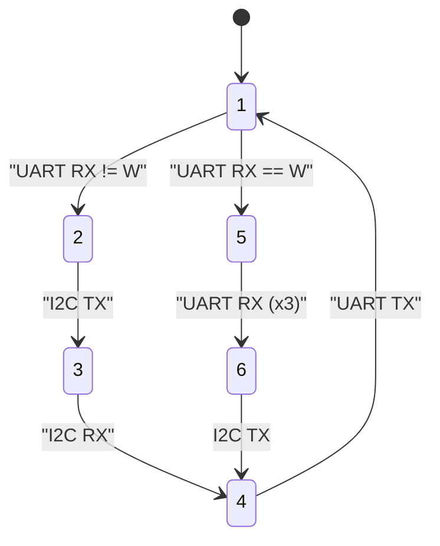

# Diagrama da Máquina de Estados

O projeto implementa uma máquina de estados finita com 6 estados para gerenciar a comunicação I2C com o módulo PCF8591 ADC/DAC e comunicação UART para comandos do usuário.

## Diagrama Visual


*Para adicionar a imagem, copie o arquivo "Diagrama de estados.png" para o diretório `docs/images/`*

## Versão Mermaid (Alternativa)



## Descrição dos Estados:

### Estado 1 - IDLE (Inativo)
- **Função**: Aguarda comandos UART do usuário
- **Entrada**: Comandos '0', '1', '2', '3' para leitura ADC ou 'w' para controle DAC
- **Saída**: 
  - Para Estado 2 se comando for '0'-'3' (leitura ADC)
  - Para Estado 5 se comando for 'w' (controle DAC)

### Estado 2 - I2C_TX (Transmissão I2C)
- **Função**: Envia byte de configuração para PCF8591 ADC
- **Operação**: `HAL_I2C_Master_Transmit_IT()` com canal selecionado
- **Saída**: Para Estado 3 quando transmissão I2C completar

### Estado 3 - I2C_RX (Recepção I2C)
- **Função**: Recebe dados do ADC do PCF8591
- **Operação**: `HAL_I2C_Master_Receive_IT()` para ler 2 bytes (1º dummy, 2º válido)
- **Saída**: Para Estado 4 quando recepção I2C completar

### Estado 4 - UART_TX (Transmissão UART)
- **Função**: Transmite resultados via UART para o usuário
- **Operação**: Envia valor ADC lido ou confirmação de DAC configurado
- **Saída**: Para Estado 1 quando transmissão UART completar

### Estado 5 - UART_RX (Recepção UART para DAC)
- **Função**: Recebe valor do DAC (3 bytes) via UART
- **Operação**: `HAL_UART_Receive_DMA()` para ler string do valor DAC
- **Saída**: Para Estado 6 quando recepção UART completar

### Estado 6 - I2C_DAC (Configuração DAC)
- **Função**: Configura e define valor do DAC no PCF8591
- **Operação**: `HAL_I2C_Master_Transmit_IT()` com byte de configuração + valor DAC
- **Saída**: Para Estado 4 quando transmissão I2C completar

## Fluxos de Operação:

### Leitura de Canal ADC:
```
Estado1 → Estado2 → Estado3 → Estado4 → Estado1
```

### Configuração de DAC:
```
Estado1 → Estado5 → Estado6 → Estado4 → Estado1
```

## Tratamento de Interrupções:

- **`HAL_I2C_MasterTxCpltCallback()`**: Estados 2 → 3 e 6 → 4
- **`HAL_I2C_MasterRxCpltCallback()`**: Estado 3 → 4
- **`HAL_UART_TxCpltCallback()`**: Estado 4 → 1
- **`HAL_UART_RxCpltCallback()`**: Estados 1 → 2/5 e 5 → 6